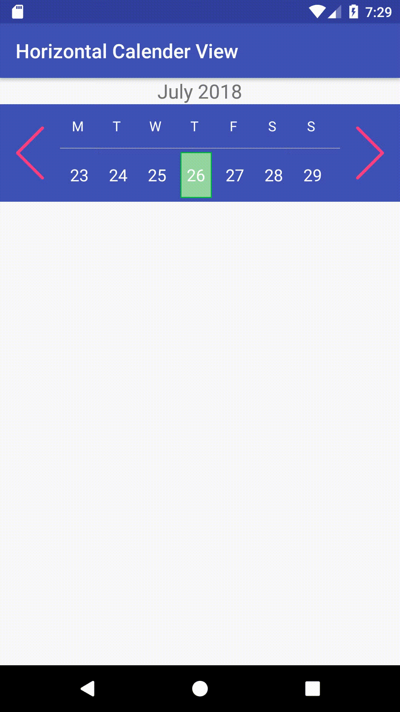
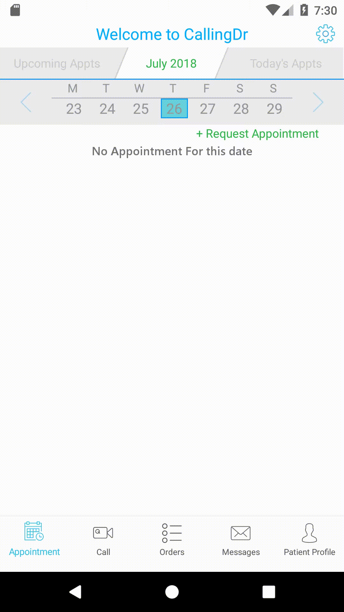

# Horizontal Calendar View - Android
Horizontal Calender View is a library for android.

## Demo 






<!-- 


 -->


## Adding Library To Your Project
### Gradle

Add following Block in root in `build.gradle(Module:app)`

``` 
allprojects {
    repositories {
        maven { url 'https://jitpack.io' }
    }
}
```

Add following line in the dependencies block in `build.gradle(Module:app)`

``` 
implementation 'com.github.mybringback22:HorizontalCalendarView-Android-:0.1.0'
```

## Using Horizontal Calendar View
### XML 

Add the followling code to your XML file

```xml
<com.view.calender.horizontal.umar.horizontalcalendarview.HorizontalCalendarView
        android:id="@+id/horizontalcalendarview"
        android:layout_width="match_parent"
        android:layout_height="200dp">
 </com.view.calender.horizontal.umar.horizontalcalendarview.HorizontalCalendarView>

```

### Java 

Now you can get the referance of the HorizontalCalendarView in the kotlin

```kotlin 
val  hcv = findViewById<HorizontalCalendarView>(R.id.horizontalcalendarview)
hcv.setContext(this@MainActivity)
```

To hide the left right contorls you can use the following method

```kotlin 
hcv.showControls(false)
```

To change the color of the left and right control use the following

```kotlin 
hcv.setControlTint(R.color.colorAccent)
```

To change the background color of the Horizontal Calendar View use the following

```kotlin 
hcv.setBackgroundColor(resources.getColor(R.color.colorPrimary))
```

To change the Text color of the Horizontal Calendar View use the following

```kotlin 
hcv.changeAccent(R.color.white)
```

## Getting Swipe or Touch Feedback
To get the feedback from the  touches and swipes of Calender implement ` HorizontalCalendarListener ` activity or fragment
```kotlin
class MainActivity : AppCompatActivity() , HorizontalCalendarListener  {

}

```


Overide the following method
- updateMonthOnScroll
- newDateSelected 

### updateMonthOnScroll
```kotlin
override fun updateMonthOnScroll(selectedDate: DayDateMonthYearModel?) {
        currentMonthTextView.text = ""+ selectedDate?.month + " " + selectedDate?.year
}

```

### newDateSelected
```kotlin
override fun newDateSelected(selectedDate: DayDateMonthYearModel?) {
        Toast.makeText(CONTEXT ,selectedDate?.date +""+ selectedDate?.month + " " + selectedDate?.year , Toast.LENGTH_LONG).show()
}

```

## DayDateMonthYearModel

`DayDateMonthYearModel` is a custom data class that is used in the library and is returned as the parameter the override method 
```java
public class DayDateMonthYearModel {
    public String date;
    public String month;
    public String year;
    public String day;
    public String monthNumeric;
    public Boolean isToday;
}
```

### Complete MainActivity.kt 

```kotlin
class MainActivity : AppCompatActivity() , HorizontalCalendarListener  {


    lateinit var currentMonthTextView : TextView
    override fun onCreate(savedInstanceState: Bundle?) {
        super.onCreate(savedInstanceState)
        setContentView(R.layout.activity_main)
        currentMonthTextView = findViewById(R.id.month)
        val  hcv = findViewById<HorizontalCalendarView>(R.id.horizontalcalendarview)
        hcv.setContext(this@MainActivity)
        hcv.setBackgroundColor(resources.getColor(R.color.colorPrimary))
        hcv.showControls(false)
        hcv.setControlTint(R.color.colorAccent)
        hcv.changeAccent(R.color.white)
    }

    override fun updateMonthOnScroll(selectedDate: DayDateMonthYearModel?) {
        currentMonthTextView.text = ""+ selectedDate?.month + " " + selectedDate?.year

    }

    override fun newDateSelected(selectedDate: DayDateMonthYearModel?) {
        Toast.makeText(this@MainActivity ,selectedDate?.date +""+ selectedDate?.month + " " + selectedDate?.year , Toast.LENGTH_LONG).show()
    }

}
```


### Complete activity_main.xml
```xml
<?xml version="1.0" encoding="utf-8"?>
<LinearLayout xmlns:android="http://schemas.android.com/apk/res/android"
    xmlns:app="http://schemas.android.com/apk/res-auto"
    xmlns:tools="http://schemas.android.com/tools"
    android:layout_width="match_parent"
    android:layout_height="match_parent"
    tools:context=".MainActivity"
    android:orientation="vertical"
    android:gravity="center_horizontal">

    <TextView
        android:id="@+id/month"
        android:layout_width="wrap_content"
        android:layout_height="wrap_content"
        android:text="Current Month"
        android:textSize="20dp"
        android:gravity="center_horizontal"
        app:layout_constraintBottom_toBottomOf="parent"
        app:layout_constraintLeft_toLeftOf="parent"
        app:layout_constraintRight_toRightOf="parent"
        app:layout_constraintTop_toTopOf="parent" />

    <com.view.calender.horizontal.umar.horizontalcalendarview.HorizontalCalendarView
        android:id="@+id/horizontalcalendarview"
        android:layout_width="match_parent"
        android:layout_height="100dp">

    </com.view.calender.horizontal.umar.horizontalcalendarview.HorizontalCalendarView>

</LinearLayout>
```

## License
MIT - License
